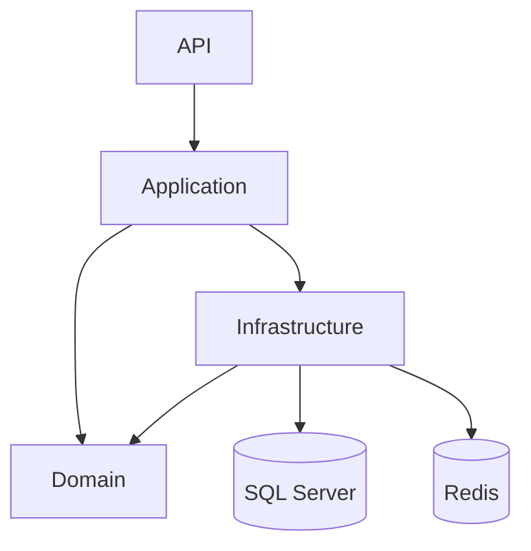
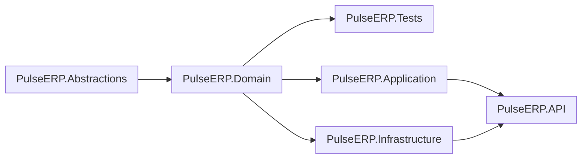

[](https://github.com/Kouumss/PulseERP/actions)  
[](LICENSE)
[](https://dotnet.microsoft.com)  

# PulseERP

>**PulseERP** est un back-end ERP modulaire conçu pour les petites et moyennes entreprises, développé en **C# 13 / .NET 9** 
Il applique rigoureusement les principes **Clean Architecture** & **Domain-Drive-Design**. : les couches Domain, Application, Abstractions, Infrastructure et API sont clairement séparées, testées (xUnit + FluentAssertions) et accompagnées d’une pipeline CI GitHub Actions qui construit, analyse et valide automatiquement chaque commit.

---

## 🏗️ Vue d’ensemble du dépôt

## 🌟 Fonctionnalités clés

- 🏗️ **Architecture hexagonale** strictement découplée (Domain, Application, Infrastructure, API)  
- 🚀 **Performances optimisées** (Entity Framework Core + Redis pour le cache)  
- 🔒 **Sécurité renforcée** (JWT avec Refresh Tokens, FluentValidation, Polly)  
- 📊 **Gestion complète** des produits, marques et clients  
- 📈 **Pagination avancée** et filtres dynamiques sur toutes les ressources  
- 🧪 **Tests unitaires & d’intégration** (xUnit + FluentAssertions)  
- 📦 **CI/CD** avec GitHub Actions pour build, tests et couverture  

---

## 📂 Structure du projet (arborescence)

```text
PulseERP/
├── .github/                     
│   └── workflows/             
│       └── ci.yml                   # Pipeline CI/CD (build, tests, couverture)
├── docker-compose.yml               # Orchestration : Redis, SQL Server, API
├── PulseERP.sln                     # Solution globale
│
├── PulseERP.Domain/                 # 🌐 Domaine métier (entités, VOs, exceptions)
│   ├── Entities/                    # — Product, User, Brand, Customer, RefreshToken …
│   ├── ValueObjects/                # — Money, EmailAddress, Role, Password, Phone …
│   └── Errors/                      # — DomainException, NotFoundException
│
├── PulseERP.Abstractions/           # 🔌 Ports & DTOs transverses
│   ├── Common/                      # — Pagination, Filters, …
│   └── Security/                    # — Auth DTO, Token, interfaces (IEmailSender, …)
│
├── PulseERP.Application/            # ⚙️ Cas d’usage, services, mapping AutoMapper
│   ├── Products/                    # — Commands, Models, Services
│   ├── Customers/                   # — Commands, Models, Services
│   ├── Mapping/                     # — Profils AutoMapper
│   └── DependencyInjection.cs       # — Enregistrement dans IServiceCollection
│
├── PulseERP.Infrastructure/         # 🛠️ Implémentations techniques
│   ├── Data/                        # — DbContext EF Core + Migrations
│   ├── Repositories/                # — Repos EF Core (avec cache Redis)
│   ├── Providers/                   # — DateTimeProvider, TokenHasher, …
│   └── Smtp/                        # — EmailSender + templates MIME
│
├── PulseERP.API/                    # 🌐 ASP.NET Core 9 – endpoints REST
│   ├── Contracts/                   # — DTOs spécifiques à l’API (ApiResponse, etc.)
│   ├── appsettings*.json            # — Config (valeurs vides pour secrets)
│   ├── Program.cs                   # — Construction du WebApplication
│   └── Dockerfile                   # — Dockerfile pour l’API
│
├── PulseERP.Tests/                  # 🧪 xUnit + FluentAssertions (unitaires & intégration)
└── README.md                        # 📄 Cette documentation

```

---

## 🔗 Diagrammes d’architecture & dépendances

### 1. Vue globale (Hexagonale)



---

### 2. Dépendances des projets (Project References)



---

### PulseERP.Tests

| Paquet                      | Version |
| --------------------------- | ------- |
| coverlet.collector          | 6.0     |
| FluentAssertions            | 8.3     |
| Microsoft.NET.Test.Sdk      | 17.14   |
| xunit                       | 2.9     |
| xunit.runner.visualstudio   | 3.1     |

---

## ⚙️ Prérequis

| Outil                    | Version minimale     | Lien                                         |
| ------------------------ | -------------------- | -------------------------------------------- |
| .NET SDK                 | 9.0.300              | https://dotnet.microsoft.com                 |
| EF Core Tools            | 9.0.\*               | https://docs.microsoft.com/ef                |
| Docker & Docker Compose  | ≥ 24.0               | https://docs.docker.com                      |
| SQL Server               | 2022 ou ultérieure   | https://www.microsoft.com/sql-server         |
| Redis                    | 7.x                  | https://redis.io                             |

---

## 🚀 Installation & configuration locale

### 1. Cloner le dépôt

```bash
git clone https://github.com/Kouumss/PulseERP.git
cd PulseERP
```

### 2. Configurer les secrets (hors Docker)

Les fichiers `appsettings*.json` contiennent des valeurs vides pour les secrets :

```jsonc
{
  "ConnectionStrings": {
    "DefaultConnection": ""
  },
  "RedisSettings": {
    "Configuration": "redis:6379",
    "InstanceName": "PulseERP:"
  },
  "Jwt": {
    "SecretKey": ""
  },
  "Email": {
    "Password": ""
  }
}
```

En environnement de développement, utilisez les User Secrets pour sécuriser la chaîne de connexion, la clé JWT, le mot de passe SMTP, etc. :


## 🔧 Compilation & tests locaux

```bash
# Restauration + build + tests
$ dotnet restore
$ dotnet build -c Release
$ dotnet test
```

### Couverture de code

```bash
$ dotnet test --collect:"XPlat Code Coverage"
$ reportgenerator -reports:**/coverage.cobertura.xml -targetdir:CoverageReport
```

Ouvre `CoverageReport/index.htm` dans ton navigateur.

---

## 🚀 Lancer l’API

```bash
$ cd PulseERP.API
$ dotnet run --launch-profile https
# Swagger : https://localhost:5001/swagger
```

Variables d’environnement essentielles :

| Nom                          | Exemple                                                   | Description              |
| ---------------------------- | --------------------------------------------------------- | ------------------------ |
| `ConnectionStrings__Default` | `Server=.;Database=PulseERP;TrustServerCertificate=True;` | DB SQL Server/PostgreSQL |
| `Jwt__SecretKey`             | `V3ryLongR@ndomKey…`                                      | Clé HMAC JWT 512 bits    |
| `Email__Password`            | `***`                                                     | Mot de passe SMTP        |

---

## 🌀 CI GitHub Actions

Fichier : `.github/workflows/ci.yml`

```yaml
name: build-test
on:
  push:
    branches: [ main ]
jobs:
  build:
    runs-on: ubuntu-latest
    steps:
      - uses: actions/checkout@v4
      - uses: actions/setup-dotnet@v4
        with:
          dotnet-version: 9.0.x
      - run: dotnet restore
      - run: dotnet build -c Release --no-restore
      - run: dotnet test --no-restore --collect:"XPlat Code Coverage"
      - uses: actions/upload-artifact@v4
        with:
          name: coverage
          path: '**/coverage.cobertura.xml'
```

Un push sur **main** ⇒ build, tests, rapport de couverture.

---

## 🎯 Principes clés du projet

* **Clean Architecture** : toutes les dépendances pointent vers le domaine.
* **DDD** : Value Objects immuables (`Money`, `Role`, `EmailAddress`…), agrégats (`Product`, `User`).
* **Validation** : FluentValidation via pipeline `ValidationBehavior` dans Application.
* **Résilience** : Polly (retry, circuit‑breaker) bientôt ajouté dans Infrastructure.
* **Logging structuré** : Serilog JSON + enrichers (UserId, CorrelationId) + Export OpenTelemetry (à venir).

---

---

## 🤝 Contribuer

1. Fork : `git clone`
2. `git checkout -b feature/ma-feature`
3. Code + tests : `git commit -m "feat: …"`
4. `git push origin feature/ma-feature`
5. Ouvre une **Pull Request** (la CI se déclenchera)

---

## 📄 Licence

Copyright © 2024 Koumayl Messaoudi. All rights reserved.

This software is proprietary and confidential.  
Unauthorized copying of this file, via any medium, is strictly prohibited.  
All rights reserved.

For permissions, contact: [koumayl.messaoudi@gmail.com]


---

> Made with ❤️ & ☕ by the PulseERP maintainers.


