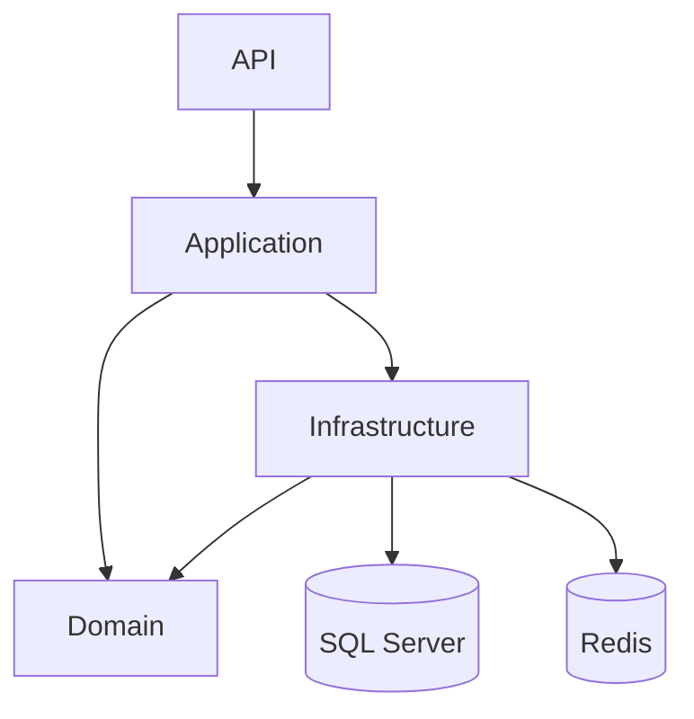
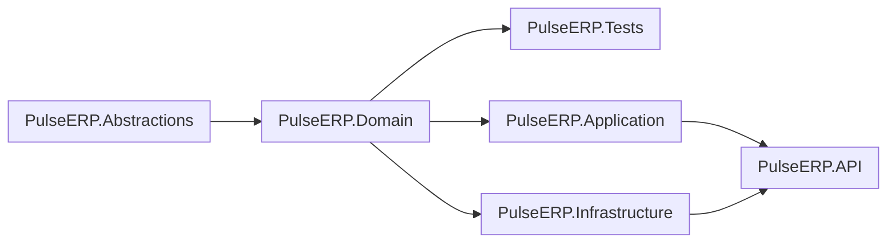

[](https://github.com/Kouumss/PulseERP/actions)  
[](https://dotnet.microsoft.com)  
[](LICENSE)

> **PulseERP** est un back-end ERP modulaire, moderne et évolutif pour PME, conçu avec **C# 13 / .NET 9** suivant les principes **Clean Architecture** et **Domain-Driven Design**.
---

## 🌟 Fonctionnalités clés

- 🏗️ **Architecture hexagonale** strictement découplée (Domain, Application, Infrastructure, API)  
- 🚀 **Performances optimisées** (Entity Framework Core + Redis pour le cache)  
- 🔒 **Sécurité renforcée** (JWT avec Refresh Tokens, FluentValidation, Polly)  
- 📊 **Gestion complète** des produits, marques et clients  
- 📈 **Pagination avancée** et filtres dynamiques sur toutes les ressources  
- 🧪 **Tests unitaires & d’intégration** (xUnit + FluentAssertions)  
- 📦 **CI/CD** avec GitHub Actions pour build, tests et couverture  

---

## 📂 Structure du projet (arborescence)

```text
PulseERP/
├── .github/                     
│   └── workflows/             
│       └── ci.yml                   # Pipeline CI/CD (build, tests, couverture)
├── docker-compose.yml               # Orchestration : Redis, SQL Server, API
├── PulseERP.sln                     # Solution globale
│
├── PulseERP.Domain/                 # 🌐 Domaine métier (entités, VOs, exceptions)
│   ├── Entities/                    # — Product, User, Brand, Customer, RefreshToken …
│   ├── ValueObjects/                # — Money, EmailAddress, Role, Password, Phone …
│   └── Errors/                      # — DomainException, NotFoundException
│
├── PulseERP.Abstractions/           # 🔌 Ports & DTOs transverses
│   ├── Common/                      # — Pagination, Filters, …
│   └── Security/                    # — Auth DTO, Token, interfaces (IEmailSender, …)
│
├── PulseERP.Application/            # ⚙️ Cas d’usage, services, mapping AutoMapper
│   ├── Products/                    # — Commands, Models, Services
│   ├── Customers/                   # — Commands, Models, Services
│   ├── Mapping/                     # — Profils AutoMapper
│   └── DependencyInjection.cs       # — Enregistrement dans IServiceCollection
│
├── PulseERP.Infrastructure/         # 🛠️ Implémentations techniques
│   ├── Data/                        # — DbContext EF Core + Migrations
│   ├── Repositories/                # — Repos EF Core (avec cache Redis)
│   ├── Providers/                   # — DateTimeProvider, TokenHasher, …
│   └── Smtp/                        # — EmailSender + templates MIME
│
├── PulseERP.API/                    # 🌐 ASP.NET Core 9 – endpoints REST
│   ├── Contracts/                   # — DTOs spécifiques à l’API (ApiResponse, etc.)
│   ├── appsettings*.json            # — Config (valeurs vides pour secrets)
│   ├── Program.cs                   # — Construction du WebApplication
│   └── Dockerfile                   # — Dockerfile pour l’API
│
├── PulseERP.Tests/                  # 🧪 xUnit + FluentAssertions (unitaires & intégration)
└── README.md                        # 📄 Cette documentation

```

---

## 🔗 Diagrammes d’architecture & dépendances

### 1. Vue globale (Hexagonale)



---

### 2. Dépendances des projets (Project References)



---

### 3. Sous-modules internes (Infrastructure & Application)


---

## 📦 Paquets NuGet (versions simplifiées)

Pour chaque projet, tableau des principales dépendances NuGet (version raccourcie : major.minor).

### PulseERP.Domain (aucune dépendance externe)

| Paquet         | Version |
| -------------- | ------- |
| *— Aucune —*   |         |

---

### PulseERP.Abstractions (aucune dépendance externe)

| Paquet         | Version |
| -------------- | ------- |
| *— Aucune —*   |         |

---

### PulseERP.Application

| Paquet                                                | Version |
| ----------------------------------------------------- | ------- |
| AutoMapper.Extensions.Microsoft.DependencyInjection   | 12.0    |
| FluentValidation                                      | 12.0    |
| MediatR                                               | 11.1    |
| MediatR.Extensions.Microsoft.DependencyInjection      | 11.1    |
| Microsoft.Extensions.DependencyInjection.Abstractions | 9.0     |
| Microsoft.Extensions.Logging.Abstractions             | 9.0     |

---

### PulseERP.Infrastructure

| Paquet                                     | Version |
| ------------------------------------------ | ------- |
| BCrypt.Net-Next                            | 4.0     |
| MailKit                                    | 2.6     |
| Microsoft.EntityFrameworkCore              | 9.0     |
| Microsoft.EntityFrameworkCore.Abstractions | 9.0     |
| Microsoft.EntityFrameworkCore.Design       | 9.0     |
| Microsoft.EntityFrameworkCore.SqlServer    | 9.0     |
| Microsoft.EntityFrameworkCore.Tools        | 9.0     |
| Microsoft.Extensions.Configuration.FileExtensions | 9.0 |
| Microsoft.Extensions.Configuration.Json    | 9.0     |
| Microsoft.Extensions.Configuration.UserSecrets | 9.0  |
| Microsoft.Extensions.DependencyInjection.Abstractions | 9.0 |
| Microsoft.Extensions.Logging               | 9.0     |
| Microsoft.Extensions.Options               | 9.0     |

---

### PulseERP.API

| Paquet                                          | Version |
| ----------------------------------------------- | ------- |
| FluentValidation.DependencyInjectionExtensions   | 12.0    |
| Hellang.Middleware.ProblemDetails                | 6.5     |
| Microsoft.AspNetCore.Authentication.JwtBearer    | 9.0     |
| Microsoft.AspNetCore.OpenApi                     | 9.0     |
| Microsoft.EntityFrameworkCore.Design             | 9.0     |
| Microsoft.Extensions.Caching.Abstractions         | 9.0     |
| Microsoft.Extensions.Caching.StackExchangeRedis   | 9.0     |
| Serilog.AspNetCore                                | 9.0     |
| Serilog.Enrichers.Environment                     | 3.0     |
| Serilog.Sinks.Console                             | 6.0     |
| Serilog.Sinks.File                                | 7.0     |
| Swashbuckle.AspNetCore                            | 8.1     |
| Microsoft.Extensions.Configuration.Json           | 9.0     |
| Microsoft.Extensions.Configuration.UserSecrets    | 9.0     |
| Microsoft.Extensions.DependencyInjection.Abstractions | 9.0 |
| Microsoft.Extensions.Logging                      | 9.0     |
| Microsoft.Extensions.Options                      | 9.0     |

---

### PulseERP.Tests

| Paquet                      | Version |
| --------------------------- | ------- |
| coverlet.collector          | 6.0     |
| FluentAssertions            | 8.3     |
| Microsoft.NET.Test.Sdk      | 17.14   |
| xunit                       | 2.9     |
| xunit.runner.visualstudio   | 3.1     |

---

## ⚙️ Prérequis

| Outil                    | Version minimale     | Lien                                         |
| ------------------------ | -------------------- | -------------------------------------------- |
| .NET SDK                 | 9.0.300              | https://dotnet.microsoft.com                 |
| EF Core Tools            | 9.0.\*               | https://docs.microsoft.com/ef                |
| Docker & Docker Compose  | ≥ 24.0               | https://docs.docker.com                      |
| SQL Server               | 2022 ou ultérieure   | https://www.microsoft.com/sql-server         |
| Redis                    | 7.x                  | https://redis.io                             |

---

## 🚀 Installation & configuration locale

### 1. Cloner le dépôt

```bash
git clone https://github.com/Kouumss/PulseERP.git
cd PulseERP
```

### 2. Configurer les secrets (hors Docker)

Les fichiers `appsettings*.json` contiennent des valeurs vides pour les secrets :

```jsonc
{
  "ConnectionStrings": {
    "DefaultConnection": ""
  },
  "RedisSettings": {
    "Configuration": "redis:6379",
    "InstanceName": "PulseERP:"
  },
  "Jwt": {
    "SecretKey": ""
  },
  "Email": {
    "Password": ""
  }
}
```

En environnement de développement, utilisez les User Secrets pour sécuriser la chaîne de connexion, la clé JWT, le mot de passe SMTP, etc. :

```bash
cd PulseERP.API
dotnet user-secrets init
dotnet user-secrets set "ConnectionStrings:DefaultConnection"      "Server=(localdb)\mssqllocaldb;Database=PulseERP;Trusted_Connection=True;"
dotnet user-secrets set "Jwt:SecretKey"                             "V3ryLongR@ndomKey..."
dotnet user-secrets set "Email:Password"                             "VotreMotDePasseSMTP"
```

> **Remarque :**  
> Si vous préférez ne pas utiliser les User Secrets, définissez les variables d’environnement au niveau du système ou du shell.

### 3. Compiler et exécuter sans Docker

```bash
dotnet restore
dotnet build --configuration Release
dotnet test
cd PulseERP.API
dotnet run --launch-profile https
```

L’API sera accessible sur :  
```
https://localhost:5001/swagger
```

### 4. Variables d’environnement (hors Docker)

| Nom                                    | Exemple                                                                                                | Description                                 |
| -------------------------------------- | ------------------------------------------------------------------------------------------------------ | ------------------------------------------- |
| `ConnectionStrings__DefaultConnection` | `Server=.;Database=PulseERP;Trusted_Connection=True;`                                                  | Chaîne de connexion SQL Server              |
| `Jwt__SecretKey`                       | `V3ryLongR@ndomKey…`                                                                                    | Clé HMAC JWT 512 bits                       |
| `Email__Password`                      | `VotreMotDePasseSMTP`                                                                                  | Mot de passe pour SMTP (ex. Gmail, SendGrid) |
| `RedisSettings__Configuration`         | `redis:6379`                                                                                           | Adresse Redis (hôte:port)                   |
| `RedisSettings__InstanceName`          | `PulseERP:`                                                                                            | Préfixe optionnel pour les clés Redis       |

---

## 📦 Exécution via Docker Compose

Le fichier `docker-compose.yml` permet de lancer en une seule commande :

- Redis (cache distribué)  
- SQL Server (base de données)  
- API PulseERP (conteneur ASP.NET Core)

```yaml
version: "3.9"

services:
  redis:
    image: redis:7-alpine
    container_name: pulseerp-redis
    ports:
      - "6379:6379"
    networks:
      - pulseerp-net

  sqlserver:
    image: mcr.microsoft.com/mssql/server:2022-latest
    container_name: pulseerp-sql
    environment:
      SA_PASSWORD: "${SQL_SA_PASSWORD}"
      ACCEPT_EULA: "Y"
    ports:
      - "1433:1433"
    volumes:
      - sql-data:/var/opt/mssql
    networks:
      - pulseerp-net

  pulseerp-api:
    build:
      context: .
      dockerfile: PulseERP.API/Dockerfile
    container_name: pulseerp-api
    depends_on:
      - redis
      - sqlserver
    ports:
      - "5000:80"
    environment:
      ConnectionStrings__DefaultConnection: "${SQL_SA_CONNECTION_STRING}"
      RedisSettings__Configuration:        "redis:6379"
      RedisSettings__InstanceName:         "PulseERP:"
    networks:
      - pulseerp-net

volumes:
  sql-data:

networks:
  pulseerp-net:
    driver: bridge
```

### 1. Démarrer les services

```bash
export SQL_SA_PASSWORD="Admin@123"
export SQL_SA_CONNECTION_STRING="Server=sqlserver;Database=PulseERP;User Id=sa;Password=Admin@123;TrustServerCertificate=True;"

docker-compose up -d
```

- Le conteneur **redis** écoute sur `localhost:6379`  
- Le conteneur **sqlserver** écoute sur `localhost:1433` (BD PulseERP)  
- L’API sera accessible sur :  
  ```
  http://localhost:5000/swagger
  ```

### 2. Arrêter et nettoyer

```bash
docker-compose down
```

---

## 🎉 Exécution de l’API (hors Docker)

```bash
cd PulseERP.API
dotnet run --launch-profile https
```

Swagger :  
```
https://localhost:5001/swagger
```

---

## 🤝 Contribuer

1. **Fork & clone** :
   ```bash
   git clone https://github.com/Kouumss/PulseERP.git
   cd PulseERP
   ```
2. **Créer une branche** :
   ```bash
   git checkout -b feature/ma-feature
   ```
3. **Coder & tester** :
   ```bash
   git commit -m "feat: description de ma feature"
   ```
4. **Pousser & ouvrir une Pull Request** :
   ```bash
   git push origin feature/ma-feature
   ```
   La CI se déclenchera automatiquement.  
5. 🎉 Une fois validé, votre modification sera fusionnée dans `main`.

---

## 📖 Licence

Ce projet est sous licence **propriétaire**. Toute utilisation, reproduction, modification ou commercialisation sans autorisation écrite préalable est strictement interdite.  
Pour toute question : [koumayl.messaoudi@gmail.com](mailto:koumayl.messaoudi@gmail.com)

---

*Made with ❤️ & ☕ by Team PulseERP.*
